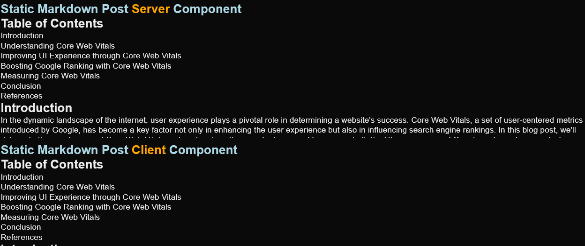
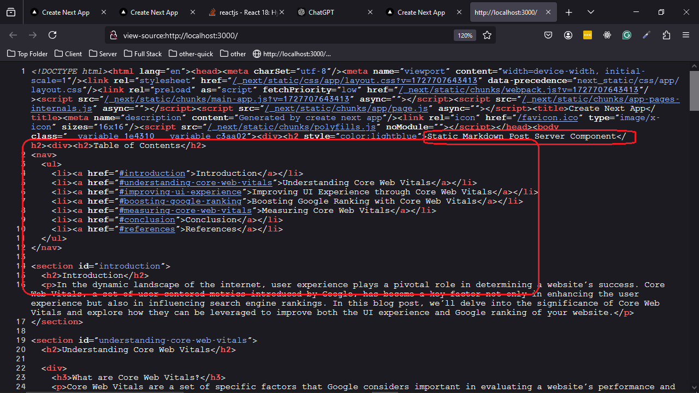
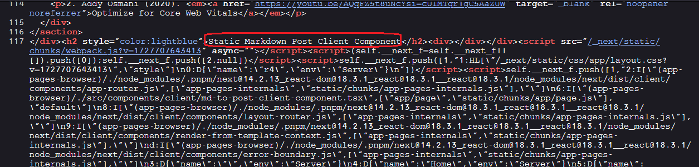

<h2>Project Description</h2>
  <p>This project demonstrates the use of React Server Components (RSC) and Client Components (RCC) in a Next.js environment to handle static Markdown content rendering.</p>

<h2>Motivation</h2>
<p>We have already explored a basic 'Hello World' implementation of React Server and Client Components in this  <a href='https://www.youtube.com/watch?v=7WhcpereZkQ'>YouTube video</a>. This project aims to investigate how server components can be used for data fetching and explains why they may be beneficial in such scenarios.</p>


<h2 >Installation</h2>

```bash
npm i
```


<h2 >Usage</h2>

```bash
npm run dev
```

<h2>Main page</h2>
  <p>The main page showcases both Server and Client components rendering the same Markdown post</p>

```tsx
export default function Home() {
  return (
    <div>
      <h2 style={{color:'lightblue'}}>Static Markdown Post Server Component</h2>
      <Md2PostServerComponent />
      <h2 style={{color:'lightblue'}}>Static Markdown Post Client Component</h2>
      <Md2PostClientComponent />
    </div>
  );
}
```


<h2>React server component</h2>

```tsx
async function Md2PostServerComponent() {
  const filePath = path.resolve(".","data","posts","post1.md");
  const fileContents = fs.readFileSync(filePath, "utf8");
  const htmlContent = marked.parse(fileContents);
  return <div dangerouslySetInnerHTML={{ __html: htmlContent }} />;
}

```

<h2>React client component</h2>

```tsx
"use client";

export default function Md2PostClientComponent() {
  const [htmlContent, setHtmlContent] = useState<string>("");
  const [loading, setLoading] = useState<boolean>(true);
  const [error, setError] = useState<string | null>(null);

  useEffect(() => {
    async function fetchMarkdown() {
      try {
        const response = await fetch("/api/markdown");
        if (!response.ok)
          throw new Error(`HTTP error! status: ${response.status}`);

        const text = await response.text();
        const html = await marked.parse(text);
        setHtmlContent(html);
      } catch (err) {
        if (err instanceof Error) setError(err.message);
        else setError("An unexpected error occurred");
      } finally {
        setLoading(false);
      }
    }
    fetchMarkdown();
  }, []);
  if (loading) return <div>Loading...</div>;
  if (error) return <div>Error: {error}</div>;
  return <div dangerouslySetInnerHTML={{ __html: htmlContent }} />;
}

```

<h2>React client component endpoint</h2>

```ts
export async function GET() {
  const filePath = path.resolve('.', 'data', 'posts', 'post1.md');
  const fileContents = fs.readFileSync(filePath, 'utf8');
  return new NextResponse(fileContents, {
    headers: {
      'Content-Type': 'text/plain',
    },
  });
}
```


<h2 id="demo">Demo</h2>
  <p>The home page renders Markdown content using both server and client components:</p>


<h2>React server components pros</h2>
<ul>
    <li><b>Performance</b>: Server components are rendered at build time, whereas client-side rendering happens when the page loads, causing a delay for users.</li>
    <li><b>Bundle Size</b>: Using server components can reduce the bundle size since libraries like <code>marked.js</code> are not needed on the client-side.</li>
    <li><b>SEO Benefits</b>: Server components produce ready-to-use HTML, which is better for search engine optimization.</li>
    <li><b>Code Size</b>: Server components have fewer source lines of code compared to client components that require endpoints.</li>
  </ul>


<h2>React Server Component - SSG (Static Site Generation)</h2>
<p>We can clearly see in the view source that the HTML is created on the server. This generation happens at build time, making the content available upfront when the page is loaded.</p>


<h2>React Client Component - CSR (Client-Side Rendering)</h2>
<p>We can see in the view source that the HTML is created on the client side, meaning it does not appear in the initial HTML source. Instead, it is dynamically rendered when the page is loaded, making it less optimal for SEO.</p>


<h2 id="references">References</h2>
<ul>
    <li> <a href='https://www.youtube.com/watch?v=7WhcpereZkQ'>Mastering Server vs. Client Components in Next.js!</a></li>
</ul>

